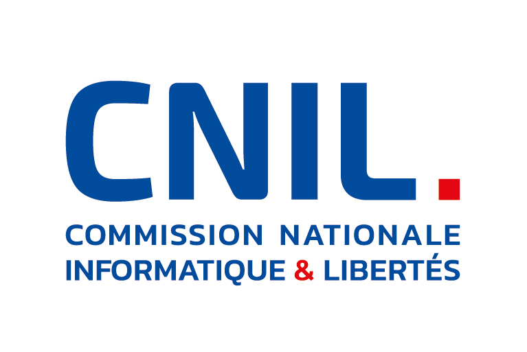

# Jolan Buisset

### Computer Science Student | Cybersecurity

I'm a Master 1 Computer Science student at Université Lumière Lyon 2, currently building my skills in cybersecurity, software development and data.

My main interests are cybersecurity, network and infrastructure security, OSINT, privacy and artificial intelligence.

---

<table>
<tr>
<td width="50%" valign="top">

## Technologies

**Languages**

**Web**

**Data**

**Tools**

**Operating Systems**

</td>

<td width="50%" valign="top">

## Areas of Interest

* Cybersecurity
* Network & infrastructure security
* Data & Data Science
* AI applied to cybersecurity
* Knowledge graphs
* Privacy & identity
* OSINT
* Pentesting

## Learning

**Atelier RGPD — CNIL**
1/6 modules completed · [Certificate](./certificates/CNIL-Atelier-RGPD-Module-1.pdf)

</td>
</tr>
</table>

---

## Selected Projects

<table>
<tr>
<td width="50%" valign="top">

### [WSUSSCN2 Knowledge Graph](https://github.com/JolanB110/wsusscn2-knowledge-graph)

Knowledge graph based on WSUSSCN2 data using Python, XQuery and Neo4j.

**Python · XQuery · XML · Neo4j · Cypher**

</td>

<td width="50%" valign="top">

### [Password Strength Lab](https://github.com/JolanB110/password-strength-lab)

Cybersecurity awareness project focused on contextual password analysis and email verification.

**Python · Web · Security**

</td>
</tr>

</table>

---
## Education

- **M1 Computer Science** · <a href="https://www.univ-lyon2.fr/">Université Lumière Lyon 2</a>
- **Bachelor's Degree — Computer Science** · <a href="https://www.univ-lyon2.fr/">Université Lumière Lyon 2</a>

---

## Contact

 
